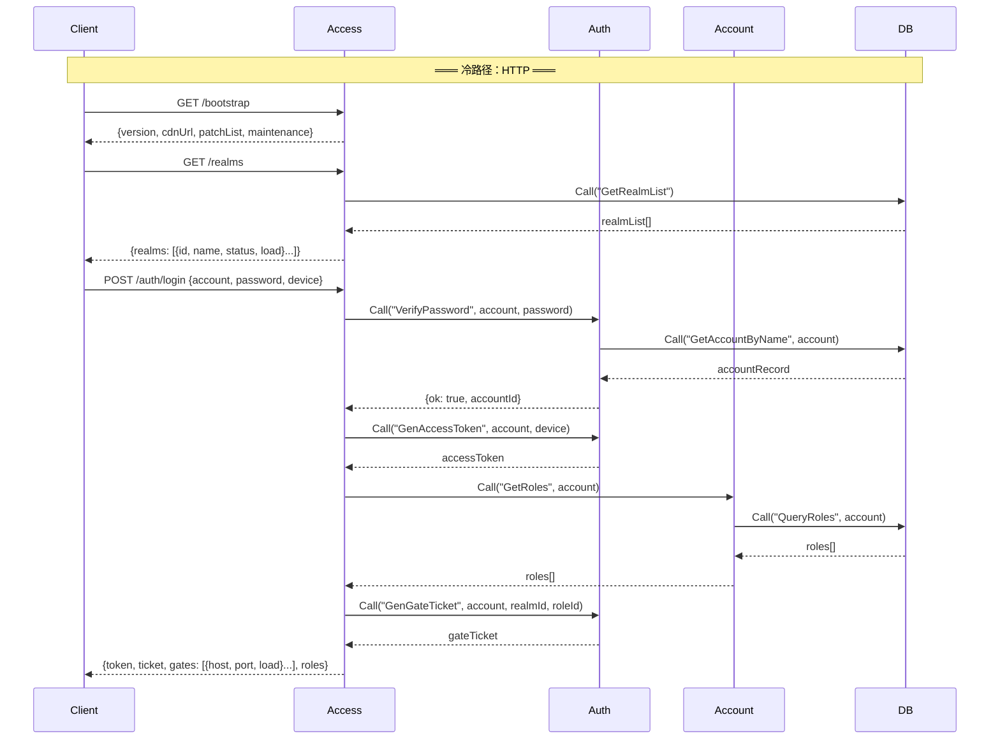
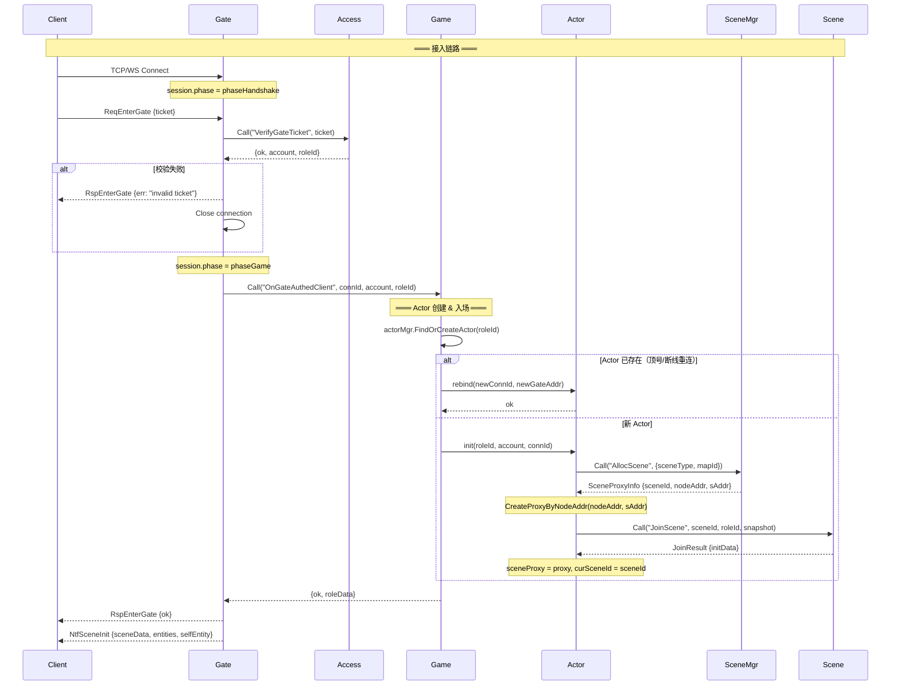
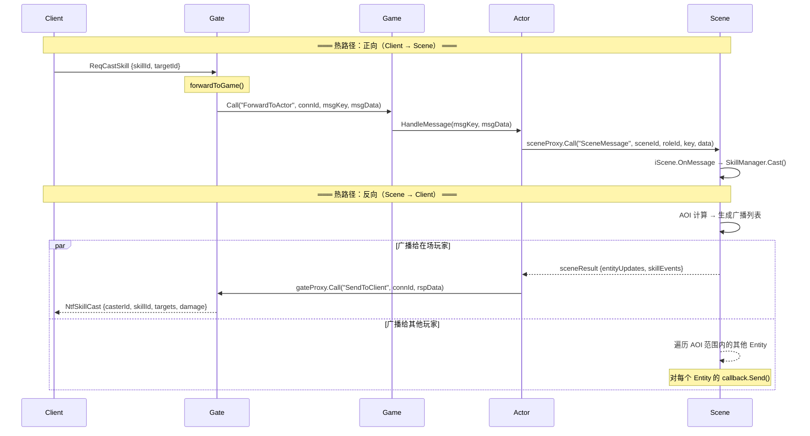
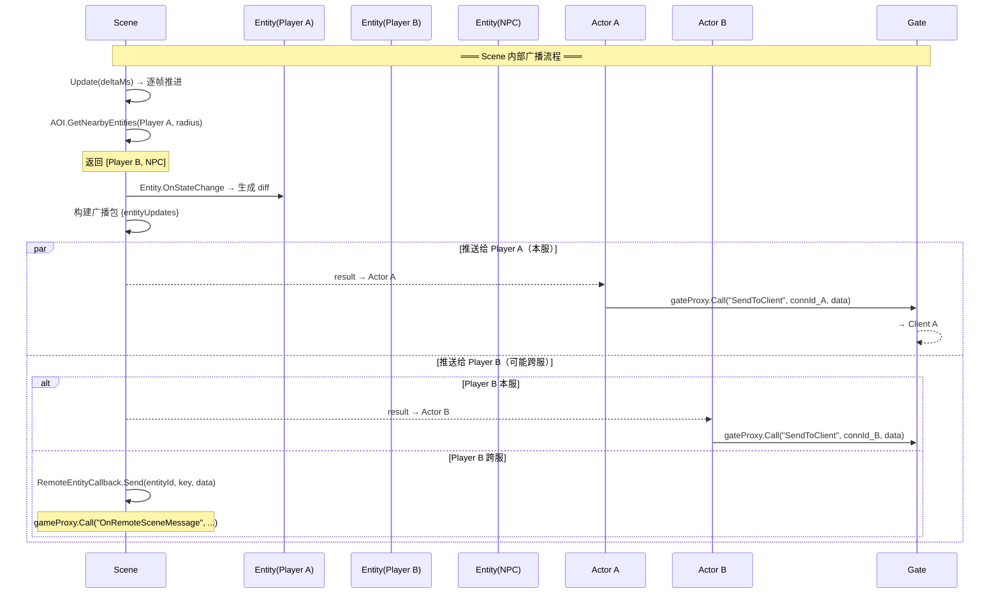
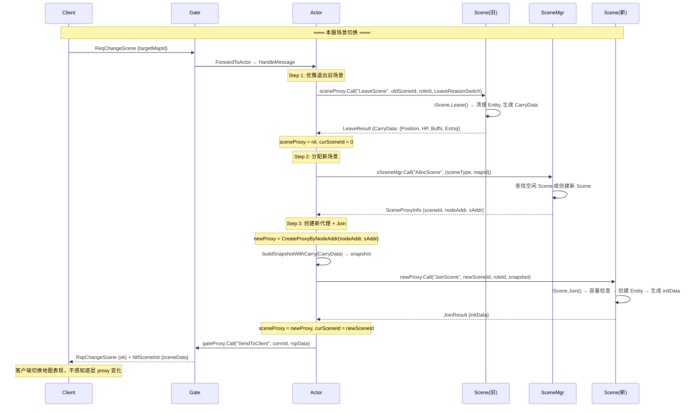
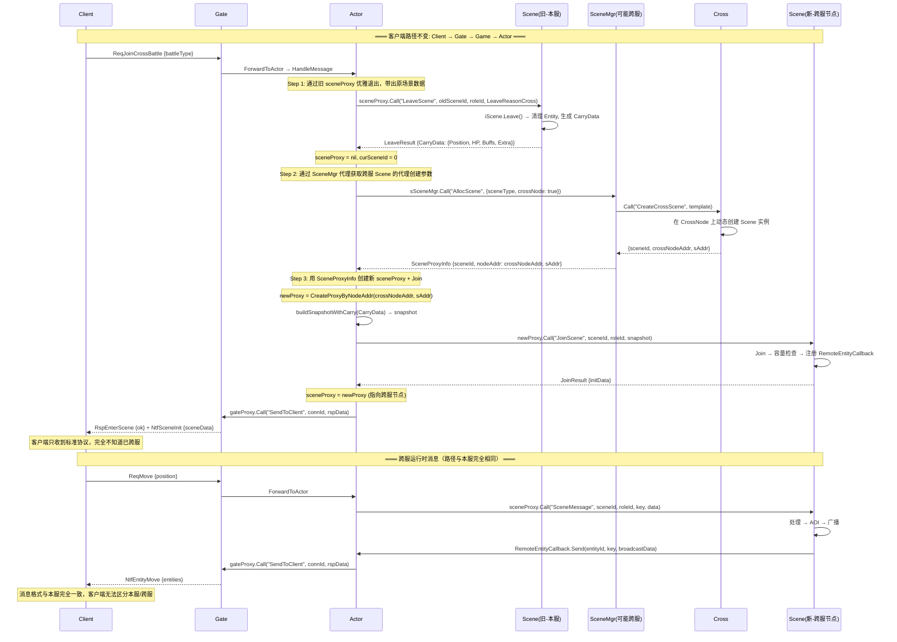
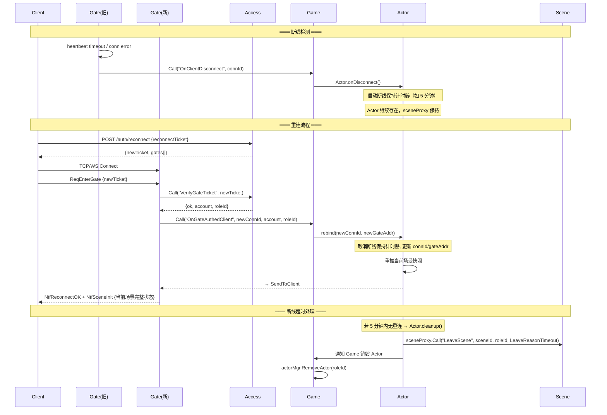
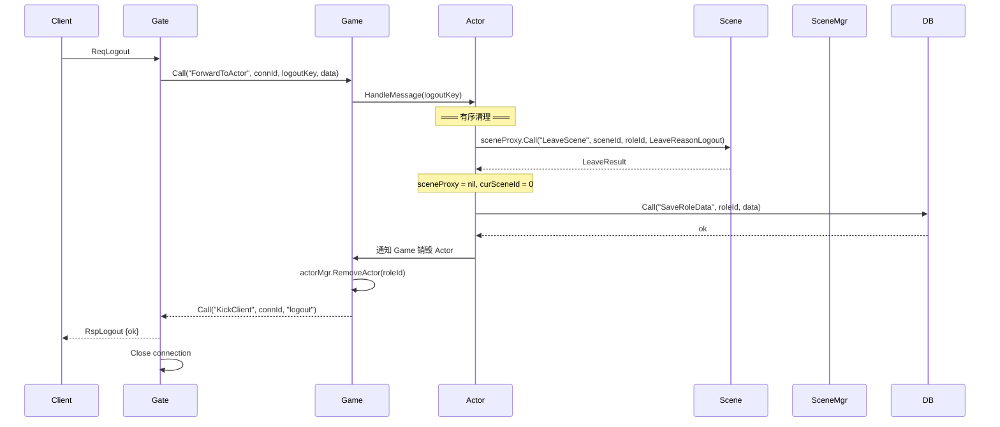
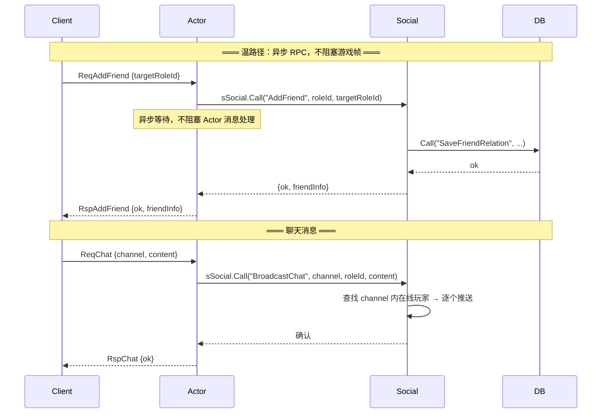
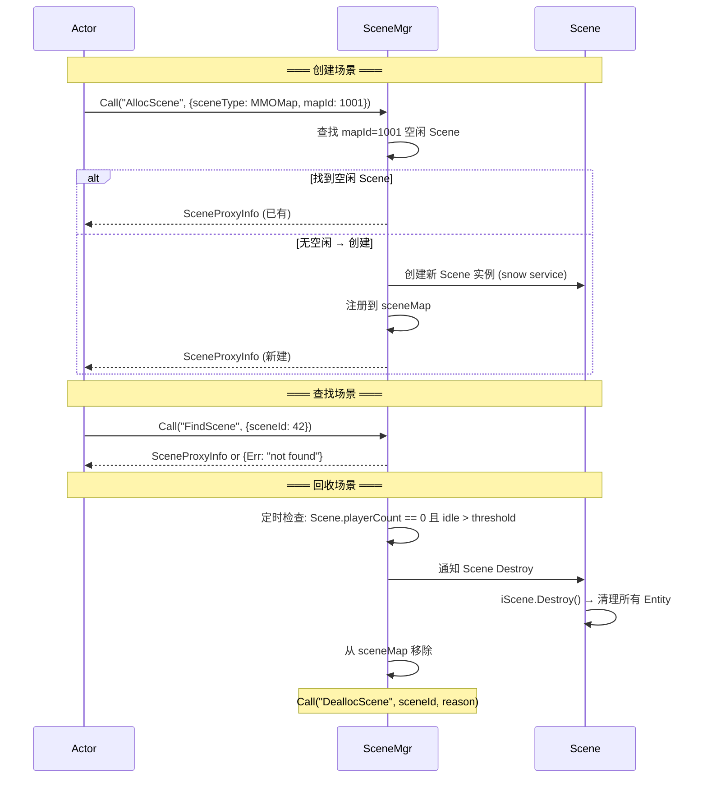

# 通用网游服务器架构文档（终版）

> 面向 MMO / SLG / 卡牌及混合品类的通用服务端框架
> 基于 snow 分布式 Actor 框架，采用"控制面 + 接入层 + Realm 业务层 + 全局层"分层设计

---

## 目录

1. [设计目标与核心原则](#1-设计目标与核心原则)
2. [整体架构拓扑](#2-整体架构拓扑)
3. [服务清单与职责](#3-服务清单与职责)
4. [统一通信规范](#4-统一通信规范)
5. [Actor 模型](#5-actor-模型)
6. [消息流转全景图](#6-消息流转全景图)
7. [各链路详细时序图](#7-各链路详细时序图)
8. [各 Service 详细设计](#8-各-service-详细设计)
9. [优雅切场景](#9-优雅切场景)
10. [部署模型](#10-部署模型)
11. [错误处理与容灾](#11-错误处理与容灾)
12. [监控与可观测性](#12-监控与可观测性)
13. [品类适配](#13-品类适配)
14. [代码目录结构](#14-代码目录结构)
15. [演进路线](#15-演进路线)

---

## 1. 设计目标与核心原则

**目标定位**：通用游戏服务器框架，承载 MMO / SLG / 卡牌及混合品类。

**核心原则**：

| # | 原则 | 说明 |
|---|------|------|
| 1 | 消息驱动 | 所有游戏逻辑通过状态消息处理驱动，消息沿固定路径流转并原路返回 |
| 2 | 平台层与玩法无关 | Access / Auth / Account / Gate 不含任何玩法逻辑 |
| 3 | Actor 统一运行时 | 每个在线玩家对应一个 Actor，所有业务在 Actor 内串行处理 |
| 4 | 热路径最短 | 同节点 sceneProxy 近零开销，跨节点自动 RPC |
| 5 | 玩法模块插拔 | 不同游戏类型通过不同 Scene 实现 + Actor Module 适配 |
| 6 | 统一通信 | 所有 service 间必须通过 IProxy + Rpc，禁止直调实例方法 |
| 7 | 跨服透明 | 本服/跨服切换对客户端完全无感知，消息路径 Client→Gate→Game→Actor 始终不变 |

---

## 2. 整体架构拓扑

```text
┌──────────────────────────────────────────────────────────────────────────┐
│                           Client (godot/Web)                            │
└───────────────┬──────────────────────────────────────┬───────────────────┘
                │ HTTP (冷路径)                          │ TCP/WS (热路径)
                ▼                                       ▼
┌───────────────────────────┐           ┌───────────────────────────────┐
│      AccessNode           │           │         GateNode (N)          │
│  ┌─────────┐ ┌─────────┐ │  注册/心跳   │  ┌──────────────────────┐   │
│  │ Access  │ │  Auth   │ │◄──────────│  │        Gate          │   │
│  └────┬────┘ └────┬────┘ │           │  └──────────┬───────────┘   │
│       │           │      │           └─────────────┼───────────────┘
│  ┌────┴────┐      │      │                         │ RPC (转发)
│  │ Account │      │      │                         ▼
│  └────┬────┘      │      │           ┌─────────────────────────────────┐
│       │           │      │           │         RealmNode (N)           │
│  ┌────┴────┐      │      │           │  ┌──────────────────────────┐  │
│  │   DB    │      │      │           │  │         Game             │  │
│  └─────────┘      │      │           │  │  ┌────────────────────┐  │  │
│                   │      │           │  │  │  Actor  Actor  ... │  │  │
└───────────────────┘      │           │  │  └───────┬────────────┘  │  │
                           │           │  └──────────┼───────────────┘  │
                           │           │             │ sceneProxy       │
                           │           │  ┌──────────┼───────────────┐  │
                           │           │  │      SceneMgr            │  │
                           │           │  │  (分配/查找/回收)          │  │
                           │           │  │  Game&Actor 持有其代理    │  │
                           │           │  └──────────┬───────────────┘  │
                           │           │             │ 动态创建          │
                           │           │  ┌──────────┼───────────────┐  │
                           │           │  │   Scene  Scene  Scene   │  │
                           │           │  │ (不可配置启动,按需创建)   │  │
                           │           │  │ (Join/Leave/AOI/战斗)    │  │
                           │           │  └──────────────────────────┘  │
                           │           │  ┌──────────┐  ┌───────────┐  │
                           │           │  │  Social   │  │    DB     │  │
                           │           │  └──────────┘  └───────────┘  │
                           │           └─────────────────────────────────┘
                           │
                           │           ┌─────────────────────────────────┐
                           │           │        CrossNode (远期)          │
                           │           │  ┌───────┐  ┌───────┐         │
                           └──────────►│  │ Cross │  │ Scene │         │
                                       │  └───────┘  └───────┘         │
                                       └─────────────────────────────────┘
```

**三条路径**：

```text
冷路径 (登录/选服/选角):  Client ──HTTP──► AccessNode ──RPC──► Auth/Account/DB
热路径 (游戏帧):          Client ──TCP/WS──► Gate ──RPC──► Game(Actor) ──proxy──► Scene
温路径 (异步业务):         Actor ──async RPC──► Social / DB / Cross
```

---

## 3. 服务清单与职责

| 层级 | 服务 | 职责 | 通信协议 |
|------|------|------|----------|
| 控制面 | **Access** | HTTP 入口：bootstrap / realms / gate 列表 / 运维 | HTTP (对外), RPC (对内) |
| 控制面 | **Auth** | 登录鉴权、票据（access token / gate ticket / reconnect ticket） | RPC |
| 控制面 | **Account** | 账号与角色档案 CRUD | RPC |
| 接入层 | **Gate** | TCP/WS 接入、首包校验、转发 | TCP/WS (对外), RPC (对内) |
| Realm | **Game** | Actor 生命周期、在线状态、消息分发 | RPC |
| Realm | **SceneMgr** | 场景分配 / 查找 / 回收（不做 Join/Leave） | RPC |
| Realm | **Scene** | 场景运行时：Join/Leave/消息、AOI、战斗（**动态创建，不可配置启动**） | RPC |
| 全局 | **Social** | 好友、公会、聊天、排行、邮件 | RPC |
| 跨服 | **Cross** | 跨服匹配与跨服场景编排（远期） | RPC |
| 基础设施 | **DB** | 数据访问层 | RPC |
| 工具 | **RobotMgr** | 机器人压测 | TCP/WS |

**权威归属**：

| 数据域 | 权威服务 |
|--------|----------|
| 账号/角色档案 | Account |
| 票据 | Auth |
| 连接 | Gate |
| 玩家运行时 | Game / Actor |
| 场景分配与回收 | SceneMgr |
| 场景内状态 | Scene |
| 社交关系 | Social |
| 持久化 | DB |

---

## 4. 统一通信规范

> **强制规则**：所有 service 间通信必须通过 IProxy，禁止直调实例方法。

snow 框架中 `proxy.Call("Xxx")` 会自动匹配目标 service 上定义为 `RpcXxx` 的方法，调用时**不写 Rpc 前缀**。

### 四种代理创建方式

```go
// 1) 按服务名（自动路由，框架分配目标节点）
proxy := ss.CreateProxy("Access")
proxy.Call("VerifyGateTicket", ticket).Done()

// 2) 按节点 + 服务名（指定节点上的某类服务）
proxy := ss.CreateProxyByNodeKind(nodeAddr, "Scene")
proxy.Call("JoinScene", sceneId, roleId, snapshot).Done()

// 3) 按节点 + 服务地址（精确定位某个服务实例，场景常用）
proxy := ss.CreateProxyByNodeAddr(nodeAddr, sAddr)
proxy.Call("SceneMessage", sceneId, roleId, key, data).Done()

// 4) HTTP RPC（跨进程 HTTP 调用）
proxy := ss.CreateHttpProxy("http://access:9000", "Access")
proxy.Call("VerifyGateTicket", ticket).Done()
```

### 服务间代理关系总览

```text
┌───────────────────────────────────────────────────────────────────────┐
│                         Proxy 持有关系图                               │
│                                                                       │
│  Gate ──CreateProxy──────────► Access    (票据校验)                    │
│  Gate ──CreateProxy──────────► Game      (消息转发)                    │
│                                                                       │
│  Game ──CreateProxy──────────► SceneMgr  (持有代理; 管理场景生命周期)   │
│  Game ──CreateProxy──────────► DB        (数据存取)                    │
│                                                                       │
│  Actor ─CreateProxy──────────► SceneMgr  (持有代理; 分配/查找/回收)    │
│  Actor ─CreateProxy──────────► Social    (社交操作)                    │
│  Actor ─CreateProxy──────────► DB        (存盘/读档)                   │
│  Actor ─CreateProxyByNodeAddr► Scene     (通过 SceneMgr 返回的         │
│                                           SceneProxyInfo 创建直连代理) │
│                                                                       │
│  SceneMgr ─(内部动态创建)────► Scene     (按需创建 Scene 实例)         │
│  SceneMgr ─CreateProxy───────► Cross     (跨服分配)                    │
│                                                                       │
│  Access ──CreateProxy────────► Auth      (鉴权)                       │
│  Access ──CreateProxy────────► Account   (账号)                       │
│  Access ──CreateProxy────────► DB        (持久化)                     │
│                                                                       │
│  Scene ──CreateProxyByNodeKind► Game     (跨服回推)                    │
└───────────────────────────────────────────────────────────────────────┘
```

> **Scene 代理获取流程**：Game / Actor 持有 SceneMgr 代理 → 调用 `sSceneMgr.Call("AllocScene", req)` → SceneMgr 按需动态创建 Scene 实例并返回 `SceneProxyInfo{NodeAddr, SAddr}` → 调用者使用 `CreateProxyByNodeAddr(NodeAddr, SAddr)` 创建 Scene 代理 → 通过该代理进行 RPC 通信。

---

## 5. Actor 模型

```text
Actor (per-player runtime container)
├── 基础数据
│   ├── RoleId, Name, Level
│   ├── 属性 (Attributes)
│   └── 货币 / 进度 / 成就
├── Module（可插拔业务模块）
│   ├── Inventory   (背包)
│   ├── Quest       (任务)
│   ├── Combat      (战斗)
│   ├── Activity    (活动)
│   ├── SocialAgent (社交代理)
│   └── [品类模块]   (根据游戏类型注册)
├── 服务代理
│   ├── sSceneMgr  : node.IProxy  // 仅用于分配/查找/回收
│   ├── sSocial    : node.IProxy  // 社交异步 RPC
│   └── sDB        : node.IProxy  // 存盘/读档
├── 场景状态
│   ├── sceneProxy : node.IProxy  // 当前 Scene 直接代理
│   └── curSceneId : int64        // 当前场景 ID
└── 连接绑定
    ├── connId     : uint64       // Gate 连接 ID
    └── gateAddr   : node.Addr    // Gate 节点地址
```

**Game Service 代理持有**：

```text
Game Service
├── 服务代理
│   ├── sSceneMgr : node.IProxy  // SceneMgr 代理，用于管理 Scene 生命周期
│   └── sDB       : node.IProxy  // 数据存取
└── Actor 管理
    └── actorMgr  : ActorMgr     // Actor 创建/销毁/查找
```

**关键约束**：

- Actor 不持有 Scene 实例引用，只持有 `sceneProxy`（通过 SceneMgr 返回的参数创建）
- Game 和 Actor 都通过 SceneMgr 代理按需创建 Scene，Scene 不可通过配置直接启动
- 场景切换遵循"先离后进"
- Actor 同一时刻只有一个实例（跨服/合服必须先释放旧 Actor 再建新）
- Actor 内所有逻辑串行执行，无并发风险

---

## 6. 消息流转全景图

> **核心设计**：所有游戏逻辑通过**状态消息**驱动处理。消息沿固定路径流入，处理完成后沿**反向路径**将结果推回客户端。无论本服还是跨服，客户端侧的消息路径（Client→Gate→Game→Actor）始终不变。

### 6.1 消息分类

游戏运行时的消息按处理终点分为两大类：

```text
┌─────────────────────────────────────────────────────────────────────┐
│                        消息分类总览                                  │
│                                                                     │
│  ■ 类型 A — Actor 本地处理（闭环在 Actor 内）                        │
│    请求: Client → Gate → Game → Actor                               │
│    响应: Actor → Game → Gate → Client                               │
│    示例: 查看背包、使用道具、查询属性、切换装备                       │
│                                                                     │
│  ■ 类型 B — Actor 委托后端服务处理                                   │
│    请求: Client → Gate → Game → Actor → 后端 Service                │
│    响应: 后端 Service → Actor → Game → Gate → Client                │
│                                                                     │
│    按目标 Service 细分:                                              │
│    ├─ B1: Actor → Scene      (场景操作: 移动/技能/AOI)              │
│    ├─ B2: Actor → Social     (好友/聊天/公会/排行)                  │
│    ├─ B3: Actor → DB         (存盘/读档)                            │
│    └─ B4: Actor → Cross      (跨服匹配)                             │
│                                                                     │
│  ■ 跨服透明性                                                       │
│    本服: Client → Gate → Game → Actor → Scene(本服)                 │
│    跨服: Client → Gate → Game → Actor → Scene(跨服节点)             │
│    客户端路径完全相同，Actor 内部切换 sceneProxy 指向即可            │
└─────────────────────────────────────────────────────────────────────┘
```

### 6.2 整体消息流概览

```text
┌──────────┐                                                        ┌──────────┐
│  Client  │                                                        │  Client  │
└────┬─────┘                                                        └────▲─────┘
     │ ① ReqXxx (TCP/WS)                                                │ RspXxx / NtfXxx
     ▼                                                                   │
┌─────────────────────────────────────────────────────────────────────────────────┐
│                                   Gate                                          │
│  session.phase == phaseGame → forwardToGame()                                   │
└────┬────────────────────────────────────────────────────────────────────▲────────┘
     │ ② gameProxy.Call("ForwardToActor", connId, msgKey, msgData)       │ gateProxy.Call("SendToClient", connId, rspData)
     ▼                                                                   │
┌─────────────────────────────────────────────────────────────────────────────────┐
│                                Game Service                                     │
│  actorMgr.GetActor(connId) → actor                                              │
└────┬────────────────────────────────────────────────────────────────────▲────────┘
     │ ③ actor.HandleMessage(msgKey, msgData)                            │ actor.SendToClient(rspData)
     ▼                                                                   │
┌─────────────────────────────────────────────────────────────────────────────────┐
│                                   Actor                                         │
│  dispatch(msgKey) → 业务模块处理                                                 │
│                                                                                 │
│  [类型A] Actor 本地处理完毕 → 直接 SendToClient ──────────────────────►(反向)   │
│  [类型B] 需要后端服务 → 通过 proxy.Call 委托 ──────────────────────────►(下行)   │
└────┬──────────┬──────────┬──────────┬──────────────────────────────────▲────────┘
     │ Scene    │ Social   │ DB       │ Cross                           │ callback
     ▼          ▼          ▼          ▼                                 │
┌──────────┐┌──────────┐┌──────┐┌──────────┐                           │
│  Scene   ││  Social  ││  DB  ││  Cross   │  处理完成 → 结果沿反向路径 │
│(本服/跨服)││          ││      ││          │  回到 Actor → Client      │
└──────────┘└──────────┘└──────┘└──────────┘────────────────────────────┘
```

### 6.3 三条路径与消息分类对应

```text
━━━━ 冷路径（登录/选服/选角 — HTTP） ━━━━━━━━━━━━━━━━━━━━━━━

  Client ──HTTP GET /bootstrap──► Access ──► 返回版本/CDN/降级配置
  Client ──HTTP GET /realms──────► Access ──► 返回区服列表
  Client ──HTTP POST /auth/login─► Access ──RPC──► Auth.GenAccessToken
                                           ──RPC──► Auth.GenGateTicket
                                           ──RPC──► Account.GetRoles
                                   ◄─────── 返回 {token, ticket, gates[], roles[]}

━━━━ 热路径（游戏帧，每个消息包都走） ━━━━━━━━━━━━━━━━━━━━━━

  [类型A] Actor 本地闭环:
  Client ──TCP/WS──► Gate ──RPC──► Game(Actor) ──处理完毕──► Gate ──TCP/WS──► Client
  示例: 查看背包、使用道具、切换装备

  [类型B1] Actor → Scene:
  Client ──TCP/WS──► Gate ──RPC──► Game(Actor) ──sceneProxy──► Scene
  Scene  ──result──► Actor ──► Gate ──TCP/WS──► Client
  示例: 移动、施法、AOI 交互（本服/跨服路径相同，客户端无感知）

  延迟分析：
  • 类型A: 1 跳 RPC (Gate → Game)
  • 类型B1: 1-2 跳 RPC (Gate → Game + Actor → Scene)
  • Actor → Scene: 0 跳 (同进程 IProxy) / 1 跳 RPC (跨节点/跨服)

━━━━ 温路径（异步业务，不阻塞游戏帧） ━━━━━━━━━━━━━━━━━━━━━

  [类型B2] Actor ──async RPC──► Social   (好友/聊天/公会)
  [类型B3] Actor ──async RPC──► DB       (存盘)
  [类型B4] Actor ──async RPC──► Cross    (跨服匹配)

  温路径处理完成后，结果仍沿 Actor → Game → Gate → Client 反向路径推回
```

---

## 7. 各链路详细时序图

### 7.1 客户端 Bootstrap 与登录



### 7.2 Gate 首包准入与 Actor 创建



### 7.3 游戏帧消息（热路径 — 正向 & 反向）



### 7.4 场景广播与 AOI 推送



### 7.5 场景切换（本服 — 优雅退出）



### 7.6 跨服场景切换（前端无感知）

> **跨服透明性**：客户端消息路径 Client→Gate→Game→Actor 始终不变，客户端完全无感知。
> Actor 通过 SceneMgr（可能是跨服 SceneMgr）获取 `node.Service.CreateProxyXXX()` 所需参数，
> 创建指向跨服节点的新 sceneProxy。切换前通过旧 sceneProxy 优雅退出原场景，带出所需的原场景数据（CarryData）。



### 7.7 断线与重连



### 7.8 玩家登出



### 7.9 社交异步操作（温路径）



### 7.10 SceneMgr 场景生命周期



---

## 8. 各 Service 详细设计

### 8.1 Access

对外 HTTP API：

| 方法 | 路径 | 说明 |
|------|------|------|
| GET | `/bootstrap` | 版本 / 热更 / CDN / 降级配置 |
| GET | `/realms` | 区服列表 |
| POST | `/auth/login` | 登录 → token + ticket + gate 列表 |
| POST | `/auth/reconnect` | 重连 → 新 ticket |
| POST | `/account/create-role` | 创角 |
| DELETE | `/account/delete-role` | 删角 |

对内 RPC：

```go
func (ss *Access) RpcVerifyGateTicket(ctx node.IRpcContext, ticket string)
func (ss *Access) RpcRegisterGate(ctx node.IRpcContext, meta *GateMeta)
func (ss *Access) RpcHeartbeatGate(ctx node.IRpcContext, gateId string, metrics *GateMetrics)
func (ss *Access) RpcUnregisterGate(ctx node.IRpcContext, gateId string)
```

### 8.2 Auth

```go
func (ss *Auth) RpcHashPassword(ctx node.IRpcContext, raw string)
func (ss *Auth) RpcVerifyPassword(ctx node.IRpcContext, raw string, hashed string)
func (ss *Auth) RpcGenAccessToken(ctx node.IRpcContext, account string, device string)
func (ss *Auth) RpcVerifyAccessToken(ctx node.IRpcContext, token string)
func (ss *Auth) RpcGenGateTicket(ctx node.IRpcContext, account string, realmId int64, roleId int64)
```

### 8.3 Account

```go
func (ss *Account) RpcCreateAccount(ctx node.IRpcContext, account string, hashedPwd string, platform string)
func (ss *Account) RpcGetAccount(ctx node.IRpcContext, account string)
func (ss *Account) RpcGetRoles(ctx node.IRpcContext, account string)
func (ss *Account) RpcCreateRole(ctx node.IRpcContext, account string, roleData []byte)
```

### 8.4 Gate

Session 状态机：

```text
phaseHandshake ──(ReqEnterGate + ticket 校验通过)──► phaseGame ──(logout/kick)──► phaseClosed
       │                                                  │
       └──(校验失败/超时)──► phaseClosed                    └──(断线)──► phaseClosed
```

核心逻辑：

```go
func (ss *Gate) Start(_ any) {
    ss.accessProxy = ss.CreateProxy("Access")
    ss.gameProxy = ss.CreateProxy("Game")
    ss.accessProxy.Call("RegisterGate", &GateMeta{
        GateId: ss.GateId(),
        Host:   ss.Config.TcpListenHost,
        Port:   ss.Config.TcpListenPort,
    }).Done()
}
```

首包准入流程：

1. 新连接 → session 默认 `phaseHandshake`
2. 仅允许 `ReqEnterGate` 消息
3. `accessProxy.Call("VerifyGateTicket", ticket)`
4. 校验成功 → 切 `phaseGame`
5. `gameProxy.Call("OnGateAuthedClient", connId, account, roleId)`
6. 后续消息统一走 `forwardToGame()`

### 8.5 Game

初始化与代理持有：

```go
func (ss *Game) Start(_ any) {
    ss.sSceneMgr = ss.CreateProxy("SceneMgr")   // 持有 SceneMgr 代理
    ss.sDB = ss.CreateProxy("DB")
    ss.actorMgr = NewActorMgr(ss)
}
```

对内 RPC：

```go
func (ss *Game) RpcOnGateAuthedClient(ctx node.IRpcContext,
    connId uint64, account string, roleId int64)
func (ss *Game) RpcForwardToActor(ctx node.IRpcContext,
    connId uint64, msgKey int, msgData []byte)
func (ss *Game) RpcOnClientDisconnect(ctx node.IRpcContext, connId uint64)
func (ss *Game) RpcOnRemoteSceneMessage(ctx node.IRpcContext,
    roleId int64, entityId int64, key int, data []byte)
```

职责：Actor 创建 / 销毁 / 查找 / 断线保持 / 顶号踢号 / 跨服消息中转。Game 持有 SceneMgr 代理，用于在创建 Actor 时通过 SceneMgr 按需分配 Scene。

### 8.6 SceneMgr

**只做分配和回收**，不做 Join/Leave，不做容量判定。

> **核心职责**：SceneMgr 是 Scene 服务实例的唯一创建者。**Scene 不能通过节点配置直接启动**，必须由 Game / Actor 通过 SceneMgr 代理按需动态创建。SceneMgr 创建 Scene 后返回 `SceneProxyInfo`（包含 `NodeAddr` 和 `SAddr`），调用者使用这些参数通过 `node.Service` 接口的 `CreateProxyByNodeAddr(NodeAddr, SAddr)` 创建 Scene 代理，后续所有与 Scene 的交互均通过该代理以 snow RPC 进行。

```go
func (sm *SceneMgr) RpcAllocScene(ctx node.IRpcContext, req *AllocSceneReq)
func (sm *SceneMgr) RpcFindScene(ctx node.IRpcContext, req *FindSceneReq)
func (sm *SceneMgr) RpcDeallocScene(ctx node.IRpcContext, sceneId int64, reason int)
```

**Scene 代理创建流程**：

```text
Game/Actor                    SceneMgr                         Scene
    │                             │                               │
    │  sSceneMgr.Call             │                               │
    │  ("AllocScene", req)        │                               │
    │ ──────────────────────────► │                               │
    │                             │  查找或动态创建 Scene 实例      │
    │                             │ ─────────────────────────────► │
    │                             │                               │
    │  ◄──── SceneProxyInfo ───── │                               │
    │  {SceneId, NodeAddr, SAddr} │                               │
    │                             │                               │
    │  CreateProxyByNodeAddr      │                               │
    │  (NodeAddr, SAddr)          │                               │
    │  → sceneProxy               │                               │
    │                             │                               │
    │  sceneProxy.Call("JoinScene", ...)  ────────────────────────►│
    │  sceneProxy.Call("SceneMessage", ...)  ─────────────────────►│
```

核心数据结构：

```go
type AllocSceneReq struct {
    SceneType int       // MMOMap / Instance / Room / Arena / ...
    MapId     int32     // 地图配置 ID
    CrossNode bool      // 是否跨服
    Extra     []byte    // 品类扩展参数
}

type SceneProxyInfo struct {
    SceneId   int64
    NodeAddr  node.Addr   // 用于 CreateProxyByNodeAddr 创建 Scene 代理
    SAddr     int32       // 用于 CreateProxyByNodeAddr 创建 Scene 代理
    SceneType int
    Err       error
}
```

### 8.7 Scene

> **启动方式**：Scene 服务实例由 SceneMgr 动态创建，**不能在节点配置文件中直接声明启动**。Game / Actor 通过 SceneMgr 代理发起 `AllocScene` 请求，SceneMgr 按需创建 Scene 实例，返回 `SceneProxyInfo` 供调用者创建 Scene 代理。

```go
func (ss *SceneService) RpcJoinScene(ctx node.IRpcContext, sceneId int64, roleId int64, snapshot []byte)
func (ss *SceneService) RpcLeaveScene(ctx node.IRpcContext, sceneId int64, roleId int64, reason int)
func (ss *SceneService) RpcSceneMessage(ctx node.IRpcContext, sceneId int64, roleId int64, key int, data []byte)
```

IScene 接口（品类通过不同实现适配）：

```go
type IScene interface {
    Id() int64
    Type() SceneType
    Join(roleId int64, snapshot []byte) (initData []byte, err error)
    Leave(roleId int64, reason int) (carry *EntityCarryData, err error)
    OnMessage(roleId int64, key int, data []byte)
    Update(deltaMs int64)
    Destroy()
}
```

### 8.8 Social

好友 / 公会 / 聊天 / 排行 / 邮件。全局服务，Actor 通过异步 RPC 调用。

### 8.9 Cross（远期）

跨服匹配池、跨服战场（通过 SceneMgr 透明路由）、跨服聊天。

### 8.10 DB

数据访问层。AccessNode 和 RealmNode 各有自己的 DB 实例。

---

## 9. 优雅切场景

### 数据结构

```go
type LeaveResult struct {
    CarryData *EntityCarryData
    Reason    int
    Err       error
}

type EntityCarryData struct {
    Position []float32  // 离开时坐标
    HP       int64      // 离开时血量
    Buffs    []byte     // 携带 buff
    Extra    []byte     // 副本结算奖励等
}

type EntitySnapshot struct {
    RoleId     int64
    Name       string
    Level      int32
    Position   []float32
    Attributes map[int32]int64
    Buffs      []byte
    Skills     []byte
    Appearance []byte
    Extra      []byte
}

type JoinResult struct {
    InitData []byte  // 场景初始化数据（发给客户端）
    Err      error
}
```

### switchScene 完整实现

```go
func (a *Actor) switchScene(newReq *AllocSceneReq) {
    if a.sceneProxy != nil && a.curSceneId > 0 {
        a.sceneProxy.Call("LeaveScene", a.curSceneId, int64(a.roleId), int(LeaveReasonSwitch)).
            Then(func(ret LeaveResult) {
                a.sceneProxy = nil
                a.curSceneId = 0
                a.doEnterNew(newReq, ret.CarryData)
            }).Done()
        return
    }
    a.doEnterNew(newReq, nil)
}

func (a *Actor) doEnterNew(req *AllocSceneReq, carry *EntityCarryData) {
    a.sSceneMgr.Call("AllocScene", req).
        Then(func(info SceneProxyInfo) {
            if info.Err != nil {
                a.sendError(info.Err)
                return
            }
            proxy := a.CreateProxyByNodeAddr(info.NodeAddr, info.SAddr)
            snapshot := a.buildSnapshotWithCarry(carry)
            proxy.Call("JoinScene", info.SceneId, int64(a.roleId), snapshot).
                Then(func(join JoinResult) {
                    if join.Err != nil {
                        a.sendError(join.Err)
                        return
                    }
                    a.sceneProxy = proxy
                    a.curSceneId = info.SceneId
                    a.pushSceneInit(join.InitData)
                }).Done()
        }).Done()
}
```

### 跨服回推机制

远端 Scene 中的实体通过反向 RPC 推送消息回 Actor 所在 Game：

```go
type RemoteEntityCallback struct {
    gameProxy   node.IProxy
    actorRoleId int64
}

func (cb *RemoteEntityCallback) Send(entityId int64, key int, data []byte) {
    cb.gameProxy.Call("OnRemoteSceneMessage", cb.actorRoleId, entityId, key, data).Done()
}
```

---

## 10. 部署模型

### 开发环境（AllInOne）

```yaml
Node:
  Services:
    - { Name: "Access" }
    - { Name: "Auth" }
    - { Name: "Account" }
    - { Name: "Gate" }
    - { Name: "Game" }
    - { Name: "SceneMgr" }
    # Scene 不在此配置 — 由 SceneMgr 按需动态创建
    - { Name: "Social" }
    - { Name: "DB" }
```

### 生产环境

```text
┌─────────────────────────┐
│      AccessNode (1-2)   │  控制面：Access + Auth + Account + DB
└─────────────────────────┘
┌─────────────────────────┐
│      GateNode (N)       │  接入层：Gate（无状态，可水平扩展）
└─────────────────────────┘
┌─────────────────────────┐
│      RealmNode (N)      │  业务层：Game + SceneMgr + Scene + Social + DB
└─────────────────────────┘
┌─────────────────────────┐
│      CrossNode (远期)    │  跨服：Cross + Scene + DB
└─────────────────────────┘
```

**扩容策略**：

| 瓶颈 | 扩容方式 |
|------|----------|
| 连接数 | 增加 GateNode |
| 玩家数 | 增加 RealmNode |
| 场景负载 | Scene 分片 / 迁移 |
| 跨服负载 | 增加 CrossNode |

---

## 11. 错误处理与容灾

### 11.1 RPC 超时与重试

| 分类 | RPC | 策略 |
|------|-----|------|
| 可重试（幂等） | FindScene, GetRoles, VerifyGateTicket | 超时 5s，重试 1 次 |
| 不可重试（非幂等） | AllocScene, CreateRole, JoinScene | 超时 5s，失败返回错误 |
| 热路径 | SceneMessage | 无重试，丢包由客户端重发 |

### 11.2 服务降级

| 故障 | 降级策略 |
|------|----------|
| Social 不可用 | Actor 缓存最近好友列表，聊天入队本地 buffer |
| DB 写失败 | 关键数据（货币/装备）阻塞重试 + 告警；非关键数据丢弃 |
| SceneMgr 不可用 | Actor 无法切场景，保持当前场景；新登录排队等待 |

### 11.3 Gate 故障转移

1. 客户端检测心跳超时
2. 从 Access 重新拉取 Gate 列表
3. 连接新 Gate，携带 reconnect ticket
4. 新 Gate 验票 → rebind Actor

### 11.4 Actor 异常保护

- Rpc handler 内置 panic recovery
- 异常 Actor 自动存盘 + 踢下线
- 关键操作前打 checkpoint，异常时 rollback

### 11.5 Scene 崩溃恢复

```text
Scene 崩溃 → SceneMgr 心跳超时检测 → 标记 Destroyed → 回收
           → Actor 检测 sceneProxy 不可达 → 清理 sceneProxy → 通知客户端
           → Actor 可自动 AllocScene 重新分配（如 MMO 野外）
```

---

## 12. 监控与可观测性

### 12.1 关键指标

| 指标 | 来源 | 报警阈值 |
|------|------|----------|
| 在线人数 | Game.actorMgr.Count() | > 容量 80% |
| RPC 延迟 P99 | 所有 Service | > 50ms |
| Scene 房间数 | SceneMgr.sceneMap.Len() | > 节点上限 80% |
| Gate 连接数 | Gate.sessionMgr.Count() | > 实例上限 80% |
| Actor 存盘延迟 | Game → DB | > 1s |
| Scene 帧耗时 | Scene.Update() | > 33ms (30fps) |

### 12.2 结构化日志

```json
{"ts":"2026-03-25T10:30:00Z","svc":"Game","method":"RpcOnGateAuthedClient","roleId":123,"dur_ms":2,"err":null,"traceId":"abc-123"}
```

所有 RPC 入口统一记录：service / method / 关键 ID / 耗时 / 错误 / traceId。

### 12.3 链路追踪

RPC context 传递 `traceId`，全链路可串联：

```text
Client.RequestId → Gate.traceId → Game.traceId → Scene.traceId
```

---

## 13. 品类适配

| 品类 | Scene 实现 | 特点 | 容量 |
|------|-----------|------|------|
| MMO 野外 | MMOMapScene | 大房间 + 分片 + 怪物/NPC + AOI | 数百~数千 |
| MMO 副本 | InstanceScene | 限时 + 结算销毁 + 小队 | 5~40 |
| SLG 战斗 | SLGBattleScene | 格子地图 + 异步/半实时 | 2~100 |
| 卡牌对局 | RoomScene | 匹配 → 创建 → 对局 → 结算 → 销毁 | 2~4 |
| 竞技场 | ArenaScene | 跨服 + 短周期 + 排名 | 2~10 |

所有品类通过实现 `IScene` 接口接入，`AllocSceneReq.SceneType` 决定创建哪种实现。

---

## 14. 代码目录结构

```text
server/server/internal/service/
├── platform/                    # ── 控制面 ──
│   ├── access/                  # Access Service
│   │   ├── access.go            # HTTP + 对内 RPC
│   │   └── gate_registry.go     # Gate 注册/心跳管理
│   ├── auth/                    # Auth Service
│   │   ├── auth.go              # 鉴权 RPC
│   │   └── ticket.go            # 票据生成/校验
│   └── account/                 # Account Service
│       └── account.go           # 账号/角色 CRUD
│
├── edge/                        # ── 接入层 ──
│   └── gate/
│       ├── gate.go              # Gate Service 主体
│       ├── session.go           # Session + Phase 状态机
│       └── forward.go           # 消息转发逻辑
│
├── realm/                       # ── Realm 业务层 ──
│   ├── game/
│   │   ├── game.go              # Game Service 主体
│   │   ├── actor_mgr.go         # Actor 创建/销毁/查找
│   │   └── game_login.go        # 登录/登出/断线处理
│   ├── actor/
│   │   ├── actor.go             # Actor 实例主体
│   │   ├── actor_scene.go       # switchScene / doEnterNew
│   │   ├── actor_module.go      # Module 管理
│   │   └── actor_rpc.go         # 业务 RPC 分发
│   ├── scenemgr/
│   │   ├── scenemgr.go          # SceneMgr Service
│   │   └── scene_pool.go        # Scene 池管理/回收
│   └── scene/
│       ├── scene_service.go     # Scene Service (Join/Leave/Message)
│       ├── iscene.go            # IScene 接口定义
│       ├── impl/                # 品类实现
│       │   ├── mmo_map.go       # MMOMapScene
│       │   ├── instance.go      # InstanceScene
│       │   ├── room.go          # RoomScene
│       │   ├── slg_battle.go    # SLGBattleScene
│       │   └── arena.go         # ArenaScene
│       ├── entity/              # 场景内实体系统
│       │   ├── entity_base.go
│       │   └── mod/
│       │       ├── combat/      # 战斗模块
│       │       └── ...
│       ├── aoi/                 # AOI 实现
│       └── snapshot.go          # EntitySnapshot / CarryData
│
├── social/                      # ── 全局服务 ──
│   └── social/
│       └── social.go            # Social Service
│
├── cross/                       # ── 跨服（远期） ──
│   └── cross/
│       └── cross.go             # Cross Service
│
└── comm/                        # ── 基础设施 ──
    └── db/
        └── db.go                # DB Service
```

---

## 15. 演进路线

```text
时间线:
Week 0    1    1.5   2    3    4    5    6    7    8    9   10   11   12+
 ├─P0─┤P0.5├──── P1 ────┤─P2─┤─P3─┤── P4a ──┤── P4b ──┤── P5 ──┤─ P6 → 远期
```

### Phase 0 — 架构基线（1 周）

- 冻结 Access / Gate / Game 协议边界
- 定义 ticket 模型（access token + gate ticket + reconnect ticket）
- 产出架构基线文档 + proto 扩展
- 产出物：`proto/platform.proto`, `proto/gate.proto` 定义

### Phase 0.5 — 现有代码清理（0.5 周）

- Zone → 预留为 Scene 重构基础
- 删除 `msghub/` 重复目录
- 修复 Game ↔ DB RPC 签名漂移（`GetRoles` 返回类型不匹配）
- 完成 Account `node.Register` 注册
- 产出物：代码编译通过，既有测试全绿

### Phase 1 — 控制面落地（2.5 周）

- 实现 Access Service（HTTP API + 对内 RPC）
- 实现 Auth Service（票据生成/校验）
- 实现 Account Service（账号/角色 CRUD）
- 客户端从静态 Gate 地址改为 HTTP 发现
- DB 新增 accounts / realm_list 表
- 产出物：客户端能通过 Access 走完登录流程

### Phase 2 — Gate 纯化（1 周）

- Gate 首包准入 + 纯转发
- Gate 注册 / 心跳 / draining
- Session phase 状态机
- 产出物：Gate 只做转发，无业务逻辑

### Phase 3 — Game 清理（1 周）

- 删除登录前状态机（原有 Game 里的登录逻辑）
- 引入 `RpcOnGateAuthedClient` 交接入口
- 断线保持窗口
- 产出物：Game 只管 Actor 生命周期

### Phase 4a — SceneMgr + IScene（1.5 周）

- 实现 SceneMgr Service：分配 / 查找 / 回收
- 定义 IScene 接口
- 将当前 Zone 重构为 Scene Service
- 产出物：SceneMgr 能创建/分配/回收 Scene

### Phase 4b — Actor 直连 + 切场景（1.5 周）

- Actor 持有 sceneProxy（CreateProxyByNodeAddr）
- 实现 switchScene 优雅切场景 + CarryData
- EntitySnapshot 协议
- 补充品类骨架（MMOMapScene / RoomScene / ...）
- 产出物：Actor 能在不同 Scene 间无缝切换

### Phase 5 — Social 独立（2 周）

- 落地 Social Service（好友/聊天/公会/排行/邮件）
- Actor 社交操作改为异步 RPC
- 产出物：社交系统独立运行

### Phase 6 — 跨服 + 运维（远期）

- Cross Service 跨服场景透明切换
- RemoteEntityCallback 反向推送
- 指标 / 日志 / 审计 / 灰度 / 压测
- 产出物：完整的跨服体系与运维观测能力

---

> **终版架构五项保证**：
>
> 1. SceneMgr 只做分配和回收，是 Scene 实例的唯一创建者
> 2. Scene 不能通过配置直接启动，必须由 Game / Actor 通过 SceneMgr 代理按需动态创建
> 3. Game 和 Actor 都持有 SceneMgr 代理，通过 `AllocScene` 获取 `SceneProxyInfo`（NodeAddr, SAddr），再用 `CreateProxyByNodeAddr` 创建 Scene 代理
> 4. Join/Leave 属于 Scene RPC，切场景必须先 Leave 带出 CarryData 再 Join
> 5. 统一通信：`CreateProxy* / CreateHttpProxy` + `proxy.Call("Xxx")` + snow 自动拼接 `Rpc` 前缀
